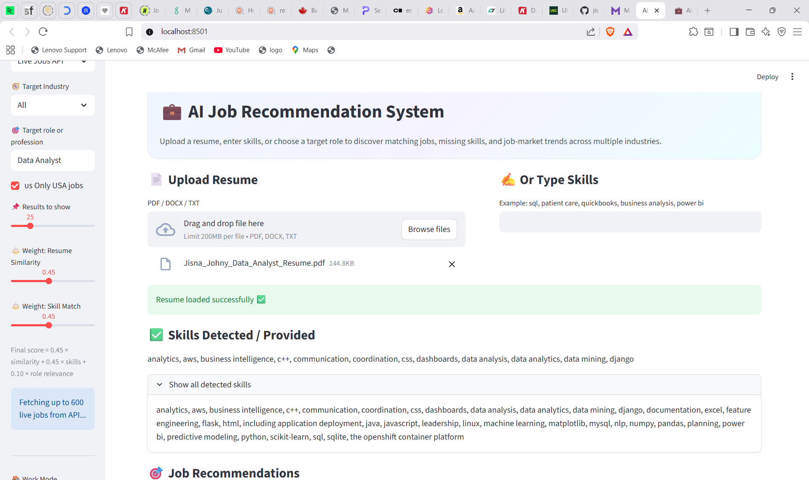
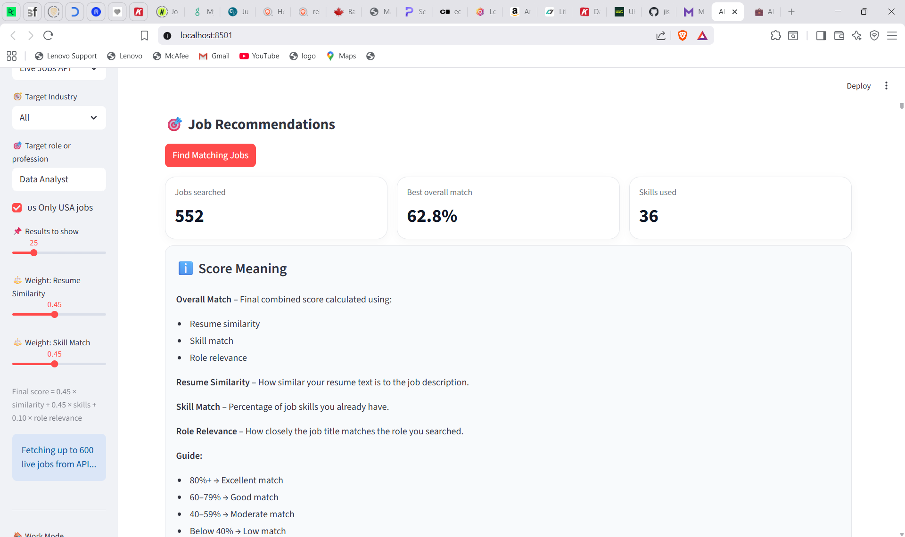
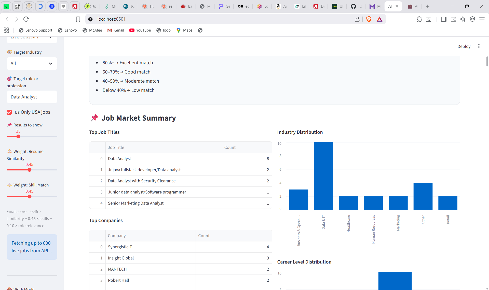
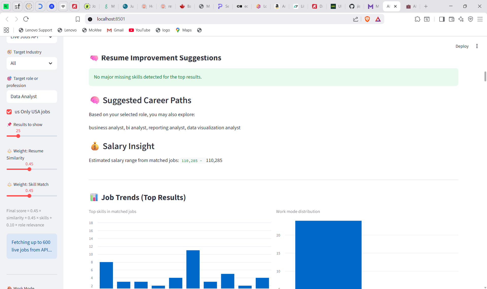

# AI-Powered Job Recommendation System

## Overview

This project is an ongoing work where I am building a system to recommend jobs based on a user's resume using NLP techniques.

## Project Status

In Progress

## Objective

The goal of this project is to:

- Extract skills from resumes
- Match them with job descriptions
- Recommend relevant jobs
- Identify missing skills

## Technologies Used

- Python
- Pandas
- Scikit-learn
- Streamlit
- TF-IDF and Cosine Similarity

## Work Completed

- Implemented resume parsing (PDF/DOCX)
- Built skill extraction logic
- Developed job matching using similarity scores
- Created a basic user interface using Streamlit

## Screenshots

### Main Interface

### Job Recommendations

### Job Market Summary

### Insights

## Future Improvements

- Add dashboard for visualization
- Integrate real-time job data (API)
- Add filters like location and work mode
- Improve recommendation accuracy

## How to Run

pip install -r requirements.txt
streamlit run app.py

## Learning Outcome

This project helped me understand how NLP can be applied to real-world problems and how recommendation systems work.

## Author

Jisna Johny
Master’s Student in Data Science
