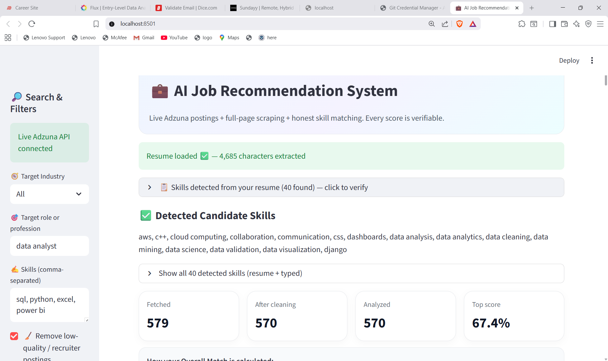
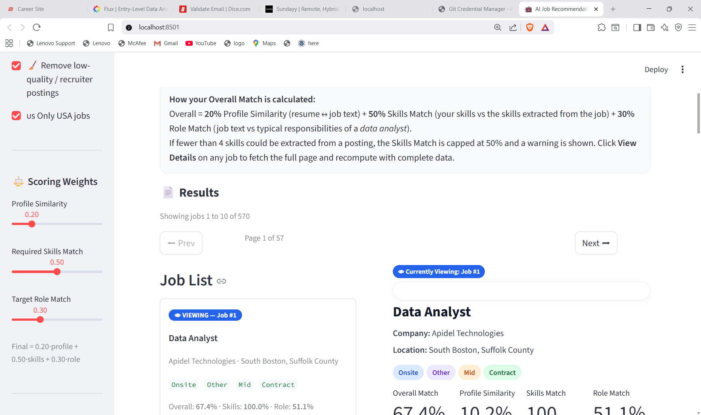
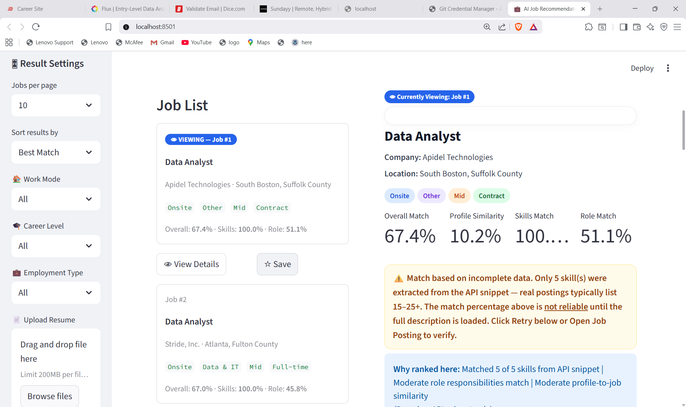
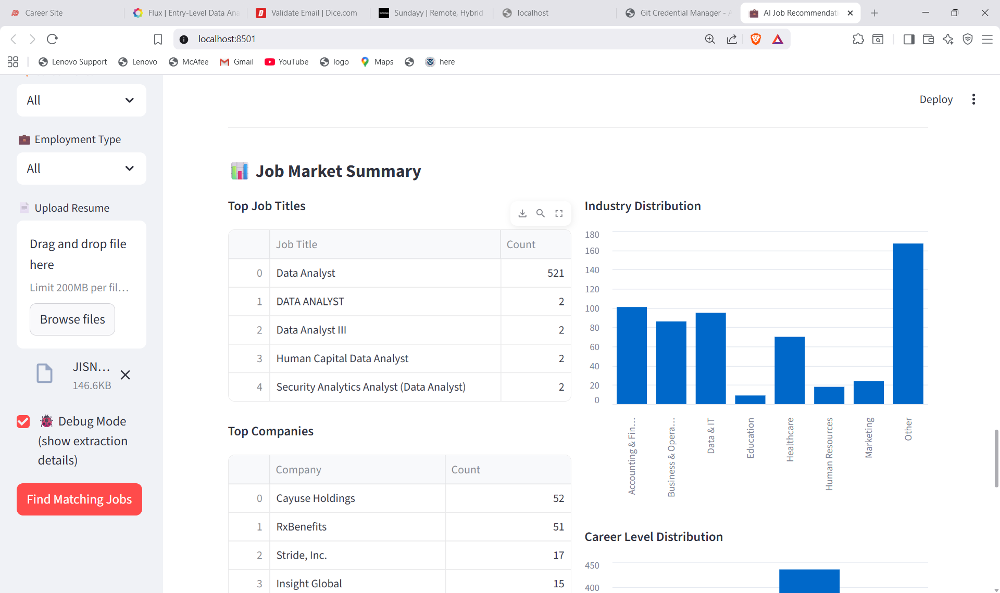
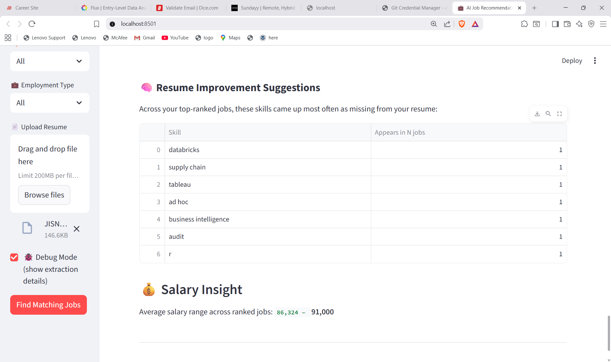

# AI-Powered Job Recommendation System

## Overview

This project presents an AI-powered Job Recommendation System that leverages Natural Language Processing (NLP) and machine learning techniques to match user resumes with relevant job opportunities. The application allows users to upload their resumes, automatically extracts skills, and compares them with real-time job postings fetched from external APIs.

To improve accuracy, the system goes beyond basic API snippets by retrieving full job descriptions and performing detailed text analysis. It then generates meaningful insights such as match scores, skill gaps, and job market trends, enabling users to make informed career decisions.
## Project Status

In Progress

## Objective

The primary objectives of this project are to:

- Extract relevant skills from resumes using NLP techniques
- Match candidate profiles with job descriptions using similarity measures
- Provide accurate job recommendations based on skill alignment
- Identify missing skills to guide resume improvement
- Analyze job market trends such as top roles, companies, and salary insights
- Build an end-to-end data-driven application for real-world career assistance

## Technologies Used

- Programming Language: Python
- Frontend / UI: Streamlit
- Data Processing & Machine Learning:Pandas, NumPy, Scikit-learn (TF-IDF Vectorization, Cosine Similarity)
- Database & Querying: SQLite, SQL
- Web Scraping: BeautifulSoup
- Resume Parsing: pdfplumber (PDF), python-docx (DOCX)
- API Integration: Adzuna Job API

## Work Completed

* Developed a resume parsing system supporting **PDF, DOCX, and TXT formats** using `pdfplumber` and `python-docx`

* Built an **NLP-based skill extraction engine** using predefined multi-industry skill dictionaries and text processing techniques

* Integrated **Adzuna Job API** to fetch **real-time job postings** across multiple roles and locations

* Implemented **full job description scraping** using `BeautifulSoup` to improve accuracy beyond API-provided snippets

* Designed and implemented a **multi-factor job matching system** including:

  * Profile Similarity (TF-IDF + Cosine Similarity)
  * Skills Match (candidate vs job requirements)
  * Role Match (alignment with target role)
  * Overall Match Score

* Developed a **skill gap analysis module** to identify:

  * ✅ Matched Skills
  * ❌ Missing Skills
  * ➕ Additional Skills

* Built an **interactive web application using Streamlit** with features like:

  * Resume upload
  * Job filtering (industry, role, location, work mode)
  * Pagination for large job datasets

* Processed and analyzed **500+ real-time job postings** to generate meaningful recommendations

* Implemented **data reliability checks** to handle incomplete job postings and ensure transparent scoring

* Created **job market analytics dashboards**, including:

  * Top job titles
  * Top hiring companies
  * Industry distribution
  * Career level trends

* Added **salary insights module** to estimate average salary ranges from job data

* Enabled **export functionality** to download ranked job results for further analysis

* Integrated **SQLite database with SQL queries** for structured data storage and efficient retrieval

---

## Screenshots

### Main Interface

### Job Recommendations

### Job Details

### Market Insights

### Salary Insights

### Resume Improvement

## Future Improvements

* 🔗 **Integrate Multiple Job APIs**
  Expand beyond Adzuna by integrating platforms like LinkedIn and Indeed to increase job coverage and diversity

* ⚡ **Performance Optimization**
  Reduce API latency and improve response time using caching, asynchronous processing, and optimized data pipelines

* 🧠 **Advanced NLP Models**
  Enhance skill extraction and matching accuracy using transformer-based models such as BERT or sentence embeddings

* 🎯 **Personalized Recommendations**
  Implement user profiling and preference learning to provide more tailored job suggestions over time

* 📊 **Enhanced Analytics Dashboard**
  Add deeper insights such as skill demand trends, salary forecasting, and location-based job analytics

* 🔐 **User Authentication System**
  Allow users to create accounts, save resumes, track applications, and monitor progress

* ☁️ **Cloud Deployment**
  Deploy the application on platforms like AWS or Azure with scalable architecture (EC2, S3, Lambda)

* 📁 **Resume Feedback System**
  Provide automated suggestions to improve resumes based on industry standards and job requirements

* 🌍 **Multi-Industry Expansion**
  Further refine and expand skill dictionaries for domains like healthcare, finance, and marketing

* 📱 **Mobile-Friendly UI**
  Improve responsiveness and design for better usability on mobile devices

* 🤖 **Chatbot Integration**
  Add an AI assistant to guide users through job searching, resume improvement, and career advice

* 🔎 **Real-Time Job Alerts**
  Enable notifications for new job postings based on user preferences and skill sets

---

## How to Run

pip install -r requirements.txt
streamlit run app.py

## Learning Outcome

- Gained hands-on experience in building an **end-to-end data science application**, from data collection to deployment
- Applied **Natural Language Processing (NLP)** techniques to extract and analyze skills from unstructured resume and job description data
- Developed a deeper understanding of **machine learning concepts**, including TF-IDF vectorization and cosine similarity for text matching
- Learned how to integrate **real-time APIs** (Adzuna) and handle live data efficiently
- Implemented **web scraping techniques** using BeautifulSoup to extract meaningful information from full job postings
- Strengthened knowledge of **SQL and database management** by storing and querying structured data using SQLite
- Improved skills in **data cleaning, preprocessing, and feature engineering** for real-world datasets
- Built an interactive **web application using Streamlit**, focusing on usability and user experience
- Designed a **multi-factor scoring system** to provide transparent and explainable recommendations
-  Developed the ability to handle **data reliability and edge cases**, ensuring accurate and honest outputs
- Gained experience in **problem-solving, debugging, and optimizing performance** in a real-world project
-  Enhanced understanding of how to translate **data insights into actionable recommendations** for users

---

## Author

Jisna Johny
Master’s Student in Data Science
